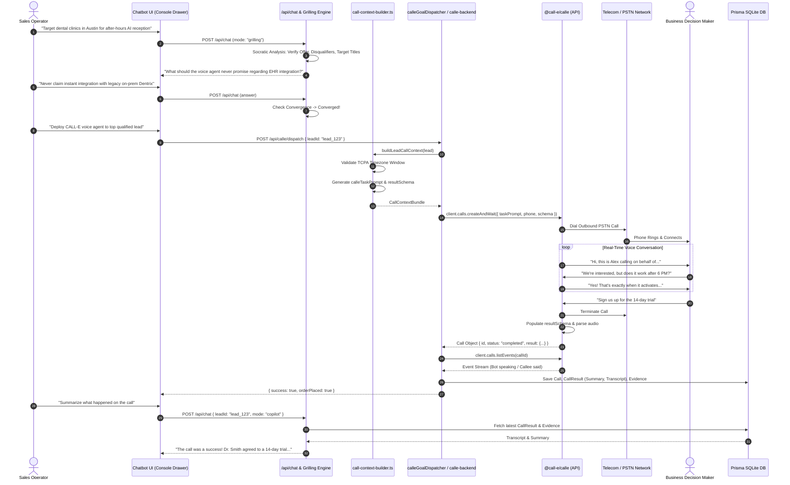

# Chatbot Architecture & CALL-E Voice Agent API Integration Guide

> **Target Audience:** Systems Architects, AI Engineers, and Backend Developers  
> **Document Purpose:** Complete architectural, operational, and code-level specification of the Conversational Chatbot Engine and its bidirectional integration with the **CALL-E Voice Agent API** (`@call-e/calle`).

---

## Table of Contents
1. [Executive Summary & System Architecture](#1-executive-summary--system-architecture)
2. [Chatbot Engine Core Components](#2-chatbot-engine-core-components)
   - [2.1 Socratic Grilling Engine](#21-socratic-grilling-engine)
   - [2.2 Multimodal Media Ingestion](#22-multimodal-media-ingestion)
   - [2.3 RAG Memory & Chunk Store](#23-rag-memory--chunk-store)
   - [2.4 Omnichannel Adapters (Web, WhatsApp, Telegram)](#24-omnichannel-adapters-web-whatsapp-telegram)
   - [2.5 Session Logger & Audit Trail](#25-session-logger--audit-trail)
3. [The Chatbot-to-CALL-E Bridge](#3-the-chatbot-to-call-e-bridge)
   - [3.1 Criteria Convergence to Call Strategy](#31-criteria-convergence-to-call-strategy)
   - [3.2 Call Context & Timezone Compliance (TCPA)](#32-call-context--timezone-compliance-tcpa)
   - [3.3 Natural-Language Voice Prompts & Schema Construction](#33-natural-language-voice-prompts--schema-construction)
4. [CALL-E API Integration Deep Dive](#4-call-e-api-integration-deep-dive)
   - [4.1 SDK Client Surface (`@call-e/calle@0.7.0`)](#41-sdk-client-surface-call-ecalle070)
   - [4.2 Dispatch Modes: Calls vs. Goal Runs](#42-dispatch-modes-calls-vs-goal-runs)
   - [4.3 Mid-Call Structured Data & B2B Order Capture](#43-mid-call-structured-data--b2b-order-capture)
   - [4.4 Transcript Extraction & Event Stream Ingestion](#44-transcript-extraction--event-stream-ingestion)
5. [Closed-Loop Feedback: Feeding Call Outcomes Back to Chat](#5-closed-loop-feedback-feeding-call-outcomes-back-to-chat)
6. [End-to-End Sequence Diagram](#6-end-to-end-sequence-diagram)
7. [API Routes, File Inventory & Reference Mapping](#7-api-routes-file-inventory--reference-mapping)
8. [Configuration & Environment Reference](#8-configuration--environment-reference)

---

## 1. Executive Summary & System Architecture

The DIAL-O conversational ecosystem bridges two distinct AI layers:
1. **Conversational Intake & Copilot Layer (Text/Multimodal):** An omnichannel conversational engine (Web, WhatsApp, Telegram) powered by Socratic dialogue, document RAG, and reasoning LLMs that gathers unique selling propositions (USPs), qualifies customer profiles, and builds outreach constraints.
2. **Autonomous Voice Telephony Layer (Audio/PSTN):** The **CALL-E Voice Agent API** that executes outbound phone calls over telephony carrier networks, speaks with human decision-makers, handles gatekeepers, negotiates interest, captures structured B2B orders/trials, and generates verbatim transcripts.

```
┌──────────────────────────────────────────────────────────────────────────────────┐
│                            OMNICHANNEL CHATBOT INTAKE                            │
│                                                                                  │
│   Web Console Drawer         WhatsApp Cloud API            Telegram Bot API      │
│   (/api/chat)                (/api/chatbot/webhook/wa)     (/api/chatbot/tg)     │
└───────────┬───────────────────────────┬────────────────────────────┬─────────────┘
            │                           │                            │
            ▼                           ▼                            ▼
┌──────────────────────────────────────────────────────────────────────────────────┐
│                      CHATBOT ORCHESTRATION & REASONING                           │
│                                                                                  │
│   ┌───────────────────────────┐           ┌──────────────────────────────────┐   │
│   │ Socratic Grilling Engine  │◄─────────►│ RAG Chunk Store & Embeddings     │   │
│   │ (Convergence & Criteria)  │           │ (Uploaded PDFs, USPs, History)   │   │
│   └─────────────┬─────────────┘           └──────────────────────────────────┘   │
└─────────────────┼────────────────────────────────────────────────────────────────┘
                  │ Criteria & Campaign Rules Converged
                  ▼
┌──────────────────────────────────────────────────────────────────────────────────┐
│                          THE CHATBOT-TO-CALL-E BRIDGE                            │
│                                                                                  │
│   ┌──────────────────────────────────────────────────────────────────────────┐   │
│   │ Call Context Builder (`call-context-builder.ts`)                         │   │
│   │  - TCPA Timezone Window Verification (08:00 - 20:00 local)               │   │
│   │  - Dynamic Voice Prompt Generator (`calleTaskPrompt`)                    │   │
│   │  - Strict JSON Extraction Schema (`resultSchema` / `B2B_ORDER_SCHEMA`)    │   │
│   └─────────────────────────────────────┬────────────────────────────────────┘   │
└─────────────────────────────────────────┼────────────────────────────────────────┘
                                          │
                                          ▼
┌──────────────────────────────────────────────────────────────────────────────────┐
│                         CALL-E VOICE TELEPHONY PLATFORM                          │
│                                                                                  │
│   ┌──────────────────────────────────────────────────────────────────────────┐   │
│   │ SDK Client (`@call-e/calle@0.7.0`) via `calle-backend.ts`                │   │
│   │                                                                          │   │
│   │  1. `client.calls.createAndWait(...)`  -> Outbound Carrier Dispatch      │   │
│   │  2. `client.goals.run(...)`            -> Autonomous Goal Execution      │   │
│   │  3. `client.calls.listEvents(...)`     -> Verbatim Dialogue Stream       │   │
│   └─────────────────────────────────────┬────────────────────────────────────┘   │
└─────────────────────────────────────────┼────────────────────────────────────────┘
                                          │ Call Transcripts, Summary, Orders
                                          ▼
┌──────────────────────────────────────────────────────────────────────────────────┐
│                           DATABASE & COPILOT FEEDBACK                            │
│                                                                                  │
│   Prisma `Call` / `CallResult`  ───►  Injected into Chatbot Context on next turn │
└──────────────────────────────────────────────────────────────────────────────────┘
```

---

## 2. Chatbot Engine Core Components

All chatbot logic resides inside `app/src/server/chatbot/` and its corresponding API routes.

### 2.1 Socratic Grilling Engine
* **Source:** [`app/src/server/chatbot/grilling-engine.ts`](file:///d:/projects/NEW_FILE/app/src/server/chatbot/grilling-engine.ts)
* **Purpose:** Acts as a specialized AI interviewer. Rather than accepting vague user inputs (e.g., *"Call dental clinics in Austin"*), the Socratic engine cross-examines the user to uncover:
  - Exact target titles (e.g., *Practice Owner, Managing Partner*).
  - Concrete Value Proposition & Disqualifiers.
  - What the AI phone agent must **never** say or promise.
  - Required pricing floors, contract lengths, or product SKU specifics.

#### Convergence Detection
The engine evaluates conversation turns against a convergence threshold:
```typescript
export interface GrillingResult {
  reply: string;               // Clean response to user
  thinking?: string;           // Reasoning trace (<think>...</think>)
  retrieved_chunks?: Chunk[];  // Injected RAG context
  converged: boolean;          // TRUE when sufficient data is gathered to trigger calling
  extracted_criteria?: {
    industries?: string[];
    geography?: string[];
    decisionMakerTitles?: string[];
    forbiddenTopics?: string[];
    pitchHook?: string;
  };
}
```
When `converged === true`, the chatbot transitions from requirement gathering to automated campaign deployment.

---

### 2.2 Multimodal Media Ingestion
* **Source:** [`app/src/server/chatbot/media-processor.ts`](file:///d:/projects/NEW_FILE/app/src/server/chatbot/media-processor.ts)
* **Purpose:** Parses attachments sent via Web, WhatsApp, or Telegram:
  - **PDF / DOCX:** Extracts raw text via `pdf-parse` ([`app/src/lib/pdf.ts`](file:///d:/projects/NEW_FILE/app/src/lib/pdf.ts)).
  - **Images (PNG, JPEG, WebP):** Formats high-resolution vision arrays for multimodal vision models (via OpenRouter).
  - **Voice Notes (Ogg/Opus, MP3, WAV):** Prepares audio for transcription.

Extracted text is split into semantic paragraphs, embedded, and pushed immediately into the active session's RAG chunk store.

---

### 2.3 RAG Memory & Chunk Store
* **Source:** [`app/src/server/chatbot/rag/chunk-store.ts`](file:///d:/projects/NEW_FILE/app/src/server/chatbot/rag/chunk-store.ts)
* **Purpose:** Lightweight vector and semantic retrieval store. 
  - Maintains document chunks per session (`SourceType = "document" | "chat_history" | "call_summary"`).
  - Computes embeddings using vector similarity or token TF-IDF scoring.
  - Retrieves the top-$k$ relevant chunks for every incoming chat prompt, guaranteeing that the AI answers with ground truth from uploaded business proposals.

---

### 2.4 Omnichannel Adapters (Web, WhatsApp, Telegram)
* **Directory:** [`app/src/server/chatbot/adapters/`](file:///d:/projects/NEW_FILE/app/src/server/chatbot/adapters/)
* **Contract:** [`ChannelAdapter`](file:///d:/projects/NEW_FILE/app/src/server/chatbot/types.ts#L50)

```typescript
export interface ChannelAdapter {
  channel: "web" | "whatsapp" | "telegram";
  receive(rawPayload: unknown): Promise<NormalizedMessage>;
  send(reply: ChannelReply): Promise<boolean>;
}
```

1. **Web Adapter (`web-adapter.ts`):** Handles Next.js HTTP payloads, session cookies, and multipart uploads.
2. **WhatsApp Adapter (`whatsapp-adapter.ts`):** Implements Meta WhatsApp Cloud API webhooks, webhook verification handshake (`hub.challenge`), media downloading from Graph API, and formatted Markdown delivery.
3. **Telegram Adapter (`telegram-adapter.ts`):** Handles Telegram Bot API updates, extracting voice notes, documents, captions, and issuing `sendMessage` with HTML styling.
4. **Registry (`registry.ts`):** Factory singleton dispatching incoming webhook requests to their respective adapter.

---

### 2.5 Session Logger & Audit Trail
* **Source:** [`app/src/server/chatbot/session-logger.ts`](file:///d:/projects/NEW_FILE/app/src/server/chatbot/session-logger.ts)
* **Storage Path:** `app/prisma/sessions/session_<sessionId>.md`
* **Purpose:** Every chat turn across all channels is written to an append-only Markdown document containing:
  - Timestamped user input and channel metadata.
  - Model reasoning traces (`<think>` blocks).
  - Chunks retrieved via RAG.
  - Final response sent.
  - Convergence state flag.

---

## 3. The Chatbot-to-CALL-E Bridge

The core handoff happens when criteria defined in the chatbot are mapped into **executable voice context** for CALL-E.

### 3.1 Criteria Convergence to Call Strategy
Once the Chatbot marks a session as converged (or the user instructs the Copilot: *"Start calling qualified leads"*), the system extracts the structured criteria and creates a calling payload.

```
Chatbot Session Criteria
├── Industry: "Pediatric Dentistry"
├── Geography: "Austin, TX"
├── Target: "Clinic Director / Practice Owner"
├── Offer: "Automated Patient Re-booking AI"
└── Guardrail: "Never quote monthly pricing over the phone"
         │
         ▼
`buildLeadCallContext()` in `call-context-builder.ts`
```

---

### 3.2 Call Context & Timezone Compliance (TCPA)
* **Source:** [`app/src/server/services/call-context-builder.ts`](file:///d:/projects/NEW_FILE/app/src/server/services/call-context-builder.ts)

Federal regulations (TCPA) and enterprise compliance forbid outbound telemarketing before 8:00 AM or after 8:00 PM local prospect time. The context builder verifies the target lead's geographical time:

```typescript
// Enforce local business hours before dispatching CALL-E
const leadHour = getLocalTimeForLead(lead.location);
if (leadHour < 8 || leadHour >= 20) {
  throw new Error(`Lead ${lead.name} in ${lead.location} is outside TCPA calling window (${leadHour}:00). Dispatch postponed.`);
}
```

---

### 3.3 Natural-Language Voice Prompts & Schema Construction
CALL-E voice agents require two core instructions:
1. **Natural-Language Task Prompt (`calleTaskPrompt`):** Instructions on persona, opening hook, handling gatekeepers, objection counters, and call goals.
2. **JSON Extraction Schema (`resultSchema`):** The schema the voice model will populate during and immediately after the live phone conversation.

#### Task Prompt Generation ([`calle-backend.ts:49`](file:///d:/projects/NEW_FILE/app/src/server/services/calle-backend.ts#L49))
```typescript
export function buildCalleTaskPrompt(lead: LeadInput, options?: CallOptions): string {
  return `You are calling ${lead.name} on behalf of DIAL-O Lead Intelligence.
Your goal is to reach the decision-maker (${lead.decisionMaker || "the Business Owner or Practice Manager"}), introduce our B2B solution, and qualify their interest.

TARGET CONTACT:
- Business: ${lead.name}
- Industry: ${lead.category || "General"}
- Location: ${lead.location || "United States"}
- Phone: ${lead.phone}

CONVERSATION INSTRUCTIONS:
1. GREETING: Politely ask for ${lead.decisionMaker || "the person who handles purchasing and operations"}.
2. HOOK: "We help ${lead.category || "local businesses"} automate front-office customer callbacks and appointment scheduling."
3. QUALIFICATION:
   - Ask how they currently handle after-hours client inquiries.
   - Ask if they would be open to a 7-day automated trial.
4. OBJECTION HANDLING:
   - If busy: Ask for the best direct time or email to follow up.
   - If not interested: Thank them politely and end the call immediately.
5. CLOSING: Confirm their preferred contact email and direct telephone number.

Be natural, concise, professional, and friendly. Do not sound robotic. Listen actively and do not interrupt.`;
}
```

---

## 4. CALL-E API Integration Deep Dive

### 4.1 SDK Client Surface (`@call-e/calle@0.7.0`)
* **TypeScript Defs:** [`app/src/types/calle.d.ts`](file:///d:/projects/NEW_FILE/app/src/types/calle.d.ts)
* **Backend Module:** [`app/src/server/services/calle-backend.ts`](file:///d:/projects/NEW_FILE/app/src/server/services/calle-backend.ts)

The client is initialized using either the official package `@call-e/calle` or HTTP fallback:

```typescript
import { CalleClient } from "@call-e/calle";

const client = new CalleClient({
  apiKey: process.env.CALL_E_API_KEY || process.env.CALLE_API_KEY,
  baseUrl: process.env.CALL_E_BASE_URL || "https://api.heycall-e.com",
});
```

---

### 4.2 Dispatch Modes: Calls vs. Goal Runs

The integration supports two execution modes depending on campaign autonomy:

#### Mode 1: Synchronous Call Execution (`calls.createAndWait`)
Used for immediate single-lead qualification initiated directly by the Copilot:

```typescript
// app/src/server/services/calle-backend.ts
const call = await client.calls.createAndWait(
  {
    task: taskPrompt,
    recipients: [{ phones: [lead.phone] }],
    resultSchema: getCalleResultSchema(),
  },
  {
    timeoutMs: 180_000,    // 3 minute max call wait
    intervalMs: 2_000,     // Poll every 2 seconds for call completion
  }
);
```

#### Mode 2: Autonomous Goal Runs (`goals.run` & `goals.waitForResult`)
Used by the MCP batch dispatcher ([`app/src/server/mcp/calle-dispatcher.ts`](file:///d:/projects/NEW_FILE/app/src/server/mcp/calle-dispatcher.ts)) for campaign goals with dynamic retries:

```typescript
// app/src/server/mcp/calle-dispatcher.ts
const goalRun = await client.goals.run(goalId, {
  target: {
    phone: lead.phone,
    name: lead.name,
    decisionMaker: lead.decisionMaker,
  },
  context: {
    taskPrompt: callContext.calleTaskPrompt,
    variables: callContext.calleVariables,
  },
  schema: B2B_ORDER_RESULT_SCHEMA,
});

const outcome = await client.goals.waitForResult(goalRun.id, {
  timeoutMs: 300_000,
  pollIntervalMs: 3_000,
});
```

---

### 4.3 Mid-Call Structured Data & B2B Order Capture
While speaking with the lead, CALL-E's LLM engine continuously parses the live audio stream into JSON adhering to `resultSchema`:

```json
{
  "qualified": true,
  "decision_maker_reached": true,
  "interest_level": "high",
  "purchase_order": {
    "product": "DIAL-O Automated Pilot",
    "quantity": 1,
    "start_date": "2026-10-01",
    "payment_method": "invoice"
  },
  "callback_requested": false,
  "verified_email": "dr.smith@austindental.com",
  "call_summary": "Spoke directly with Dr. Smith. Expressed strong interest in after-hours appointment scheduling. Agreed to 14-day trial commencing Oct 1st.",
  "confidence_score": 0.94
}
```

---

### 4.4 Transcript Extraction & Event Stream Ingestion
Once the phone call hangs up, the integration fetches the complete event stream from CALL-E to reconstruct the dialogue word-for-word:

```typescript
// app/src/server/services/calle-backend.ts:175
const events = await client.calls.listEvents(call.id, { limit: 100 });

const transcript = ((events as any).data || [])
  .filter((e: any) => e.message?.includes("Bot is speaking:") || e.message?.includes("Callee said:"))
  .map((e: any) => {
    const isBot = e.message?.includes("Bot is speaking:");
    const text = e.message?.replace("Bot is speaking: ", "").replace("Callee said: ", "") || "";
    return `${isBot ? "CALL-E (AI)" : lead.name}: ${text}`;
  })
  .join("\n");
```

---

## 5. Closed-Loop Feedback: Feeding Call Outcomes Back to Chat

The most critical architectural aspect is the **bidirectional loop**:
1. Chatbot **initiates** the call parameters.
2. CALL-E **executes** the call and writes results to the database.
3. Chatbot **consumes** the call data to answer follow-up questions from the user in real-time.

```
┌────────────────────────────────┐
│  CALL-E Finishes Phone Call    │
└───────────────┬────────────────┘
                │ Writes to Prisma DB
                ▼
┌─────────────────────────────────────────────────────────────┐
│  Prisma Tables Populated:                                   │
│   - `Call` (id, status, duration, recordingUrl)             │
│   - `CallResult` (summary, sentiment, transcript, metadata) │
│   - `Evidence` (extracted claims, facts, quote snippets)    │
└─────────────────────────────────────────────────────────────┘
                │
                ▼
┌─────────────────────────────────────────────────────────────┐
│  User types in Copilot:                                     │
│  "What did Dr. Smith say about our pricing?"                │
└─────────────────────────────────────────────────────────────┘
                │
                ▼
┌─────────────────────────────────────────────────────────────┐
│  `app/src/app/api/chat/route.ts` Ingests DB State:          │
│                                                             │
│  const lead = await prisma.lead.findUnique({                │
│    where: { id: leadId },                                   │
│    include: {                                               │
│      calls: { include: { result: true }, take: 1 },         │
│      evidence: true                                         │
│    }                                                        │
│  });                                                        │
│                                                             │
│  context.callSummary = lead.calls[0]?.result?.summary;      │
│  context.leadEvidence = lead.evidence.map(e => e.claim);    │
└─────────────────────────────────────────────────────────────┘
                │ Injected into LLM Prompt
                ▼
┌─────────────────────────────────────────────────────────────┐
│  Chatbot Answers User:                                      │
│  "Dr. Smith was open to the trial, but noted that their     │
│   current contract with Dentrix lasts until November."      │
└─────────────────────────────────────────────────────────────┘
```

---

## 6. End-to-End Sequence Diagram



---

## 7. API Routes, File Inventory & Reference Mapping

| File Path | Role in Architecture |
|---|---|
| [`app/src/server/chatbot/grilling-engine.ts`](file:///d:/projects/NEW_FILE/app/src/server/chatbot/grilling-engine.ts) | Socratic questioning engine; checks requirement convergence before calling. |
| [`app/src/server/chatbot/media-processor.ts`](file:///d:/projects/NEW_FILE/app/src/server/chatbot/media-processor.ts) | Ingests PDF sales collateral and extract pitch hooks for the phone agent. |
| [`app/src/server/chatbot/rag/chunk-store.ts`](file:///d:/projects/NEW_FILE/app/src/server/chatbot/rag/chunk-store.ts) | Semantic vector memory feeding company context into voice prompts. |
| [`app/src/server/chatbot/session-logger.ts`](file:///d:/projects/NEW_FILE/app/src/server/chatbot/session-logger.ts) | Stores conversational audit transcripts in `app/prisma/sessions/`. |
| [`app/src/server/chatbot/adapters/`](file:///d:/projects/NEW_FILE/app/src/server/chatbot/adapters/) | Web, WhatsApp, and Telegram adapters for omnichannel chat. |
| [`app/src/app/api/chat/route.ts`](file:///d:/projects/NEW_FILE/app/src/app/api/chat/route.ts) | Primary endpoint routing user messages to Grilling or Copilot modes. |
| [`app/src/server/services/call-context-builder.ts`](file:///d:/projects/NEW_FILE/app/src/server/services/call-context-builder.ts) | Compiles chatbot findings into TCPA-compliant prompts and JSON schemas. |
| [`app/src/server/services/calle-backend.ts`](file:///d:/projects/NEW_FILE/app/src/server/services/calle-backend.ts) | Direct execution wrapper around `@call-e/calle` SDK (`createAndWait`). |
| [`app/src/server/mcp/calle-dispatcher.ts`](file:///d:/projects/NEW_FILE/app/src/server/mcp/calle-dispatcher.ts) | Autonomous Goal Runs dispatcher, event logger, and DB synchronizer. |
| [`app/src/app/api/calle/dispatch/route.ts`](file:///d:/projects/NEW_FILE/app/src/app/api/calle/dispatch/route.ts) | HTTP endpoint allowing the UI/Chatbot to trigger an outbound phone call. |
| [`app/src/components/dial-o/console-section.tsx`](file:///d:/projects/NEW_FILE/app/src/components/dial-o/console-section.tsx) | Frontend console rendering both the Copilot Chat and the Call Log table. |

---

## 8. Configuration & Environment Reference

Add these keys to `app/.env.local` to configure the Chatbot and CALL-E integration:

```ini
# ─── CALL-E VOICE AGENT CONFIGURATION ───────────────────────────
CALL_E_API_KEY="calle_live_xxxxxxxxxxxxxxxxxxxx"
CALLE_API_KEY="calle_live_xxxxxxxxxxxxxxxxxxxx"
CALL_E_BASE_URL="https://api.heycall-e.com"

# Mode: "live" places real PSTN phone calls. "synthetic" simulates responses.
CALL_MODE="live"

# ─── OPENROUTER (CHATBOT & COPILOT LLM) ─────────────────────────
OPENROUTER_API_KEY="sk-or-v1-xxxxxxxxxxxxxxxxxxxx"
OPENROUTER_MODEL="nvidia/nemotron-4-340b-instruct"

# ─── OMNICHANNEL CHATBOT WEBHOOKS ───────────────────────────────
# Meta WhatsApp Cloud API
WHATSAPP_TOKEN="EAAXxxxxxxxxxxxxxxxxxxx"
WHATSAPP_VERIFY_TOKEN="dial_o_verify_token_2026"
WHATSAPP_PHONE_NUMBER_ID="109876543210987"

# Telegram Bot API
TELEGRAM_BOT_TOKEN="123456789:ABCdefGHIjklMNOpqrSTUvwxYZ"

# ─── DATABASE ───────────────────────────────────────────────────
DATABASE_URL="file:./dev.db"
```

---

*Document compiled and verified against the live codebase.*
