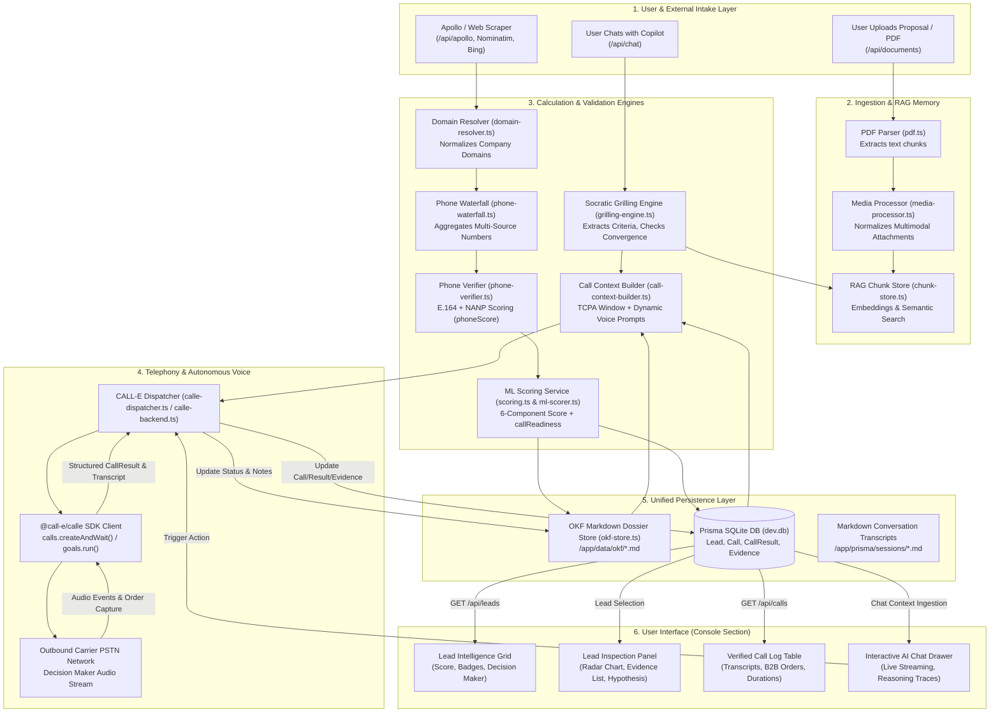
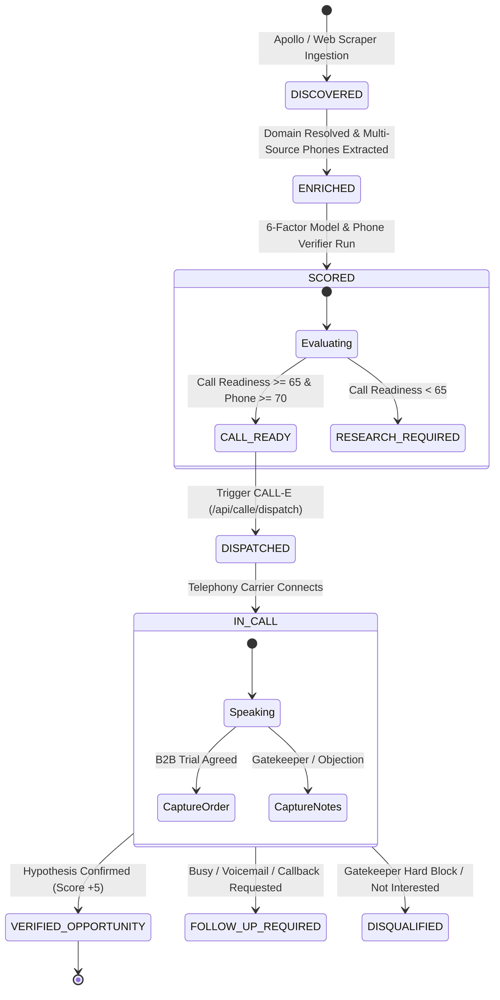

# Data Flow, Calculation Engine & UI State Architecture Guide

> **Target Audience:** Technical Architects, Lead Engineers, and Frontend/Backend Developers  
> **Purpose:** Detailed specification of data transformations, mathematical scoring calculations, component data flow, and end-to-end data state progression from ingestion to the User Interface.

---

## Table of Contents
1. [Master Data Flow Diagram](#1-master-data-flow-diagram)
2. [Mathematical Formulations & Scoring Calculations](#2-mathematical-formulations--scoring-calculations)
   - [2.1 Six-Factor Weighted Lead Scoring Model](#21-six-factor-weighted-lead-scoring-model)
   - [2.2 Phone Verification Confidence & NANP Scoring](#22-phone-verification-confidence--nanp-scoring)
   - [2.3 Composite Call Readiness Formula](#23-composite-call-readiness-formula)
   - [2.4 Data Completeness Metric](#24-data-completeness-metric)
   - [2.5 TCPA Local Calling Window Validation](#25-tcpa-local-calling-window-validation)
   - [2.6 Post-Call Verification Score Adjustment](#26-post-call-verification-score-adjustment)
3. [Data State Machine & Lifecycle Transitions](#3-data-state-machine--lifecycle-transitions)
   - [3.1 Lifecycle States (`DISCOVERED` to `VERIFIED`)](#31-lifecycle-states-discovered-to-verified)
   - [3.2 Intermediate Schema Progression: Raw → OKF → Prisma → Frontend](#32-intermediate-schema-progression-raw--okf--prisma--frontend)
4. [Component-by-Component Data Flow](#4-component-by-component-data-flow)
   - [4.1 Intake & Document Extraction Flow](#41-intake--document-extraction-flow)
   - [4.2 Discovery & Waterfall Phone Resolution Flow](#42-discovery--waterfall-phone-resolution-flow)
   - [4.3 Scoring & Hypothesis Generation Flow](#43-scoring--hypothesis-generation-flow)
   - [4.4 CALL-E Voice Dispatch & Event Logging Flow](#44-call-e-voice-dispatch--event-logging-flow)
5. [State of Data to User Interface (Frontend Hydration)](#5-state-of-data-to-user-interface-frontend-hydration)
   - [5.1 UI State Store & Mapping in `console-section.tsx`](#51-ui-state-store--mapping-in-console-sectiontsx)
   - [5.2 Reactive UI State Updates (Optimistic & Polled)](#52-reactive-ui-state-updates-optimistic--polled)
   - [5.3 Copilot Chat Context Ingestion](#53-copilot-chat-context-ingestion)
   - [5.4 Visual Token & Badge Mapping Rules](#54-visual-token--badge-mapping-rules)
6. [Complete Code References & File Mapping](#6-complete-code-references--file-mapping)

---

## 1. Master Data Flow Diagram

The diagram below tracks data from external sources and user input through the core processing services, the database, and into the frontend React DOM.



---

## 2. Mathematical Formulations & Scoring Calculations

### 2.1 Six-Factor Weighted Lead Scoring Model
* **Implementation:** [`app/src/server/services/scoring.ts`](file:///d:/projects/NEW_FILE/app/src/server/services/scoring.ts) & [`app/src/server/mcp/ml-scorer.ts`](file:///d:/projects/NEW_FILE/app/src/server/mcp/ml-scorer.ts)

Every prospect is evaluated across six orthogonal dimensions. The maximum possible score is **100 points**:

$$\text{Total Score} = S_{\text{ICP}} + S_{\text{Quality}} + S_{\text{Pain}} + S_{\text{Intent}} + S_{\text{Recency}} + S_{\text{Contact}}$$

$$\text{Total Score} \in [0, 100]$$

| Component | Weight | Key Determinants | Calculation Code Reference |
|---|---|---|---|
| **$S_{\text{ICP}}$ (ICP Fit)** | **25 pts** | Exact industry match (+12), related industry (+4), employee sweet-spot (10–30: +11, 5–100: +8), target geography (+2). | `scoreIcpFit()` |
| **$S_{\text{Quality}}$ (Business Quality)** | **15 pts** | Active HTTPS website (+4), $\ge 15$ staff (+6), verified decision maker (+2), established track record in evidence (+3). | `scoreBusinessQuality()` |
| **$S_{\text{Pain}}$ (Pain Signal)** | **25 pts** | Unanswered calls (+6), hold times (+5), no online booking (+5), receptionist job openings (+5), outdated manual systems (+2). | `scorePainSignal()` |
| **$S_{\text{Intent}}$ (Market Intent)** | **20 pts** | Active RFP/solution search (+8), hiring growth (+4), recent expansion (+3), high evidence confidence ($\text{conf} > 0.85 \implies +1$). | `scoreIntent()` |
| **$S_{\text{Recency}}$ (Data Recency)** | **10 pts** | Base recency for live discovery (+7), confirmed recent signal within 30 days (+3). | `scoreRecency()` |
| **$S_{\text{Contact}}$ (Contactability)** | **5 pts** | Phone verified (+2), decision maker identified (+2), primary domain active (+1). | `scoreContactability()` |

---

### 2.2 Phone Verification Confidence & NANP Scoring
* **Implementation:** [`app/src/server/mcp/phone-verifier.ts`](file:///d:/projects/NEW_FILE/app/src/server/mcp/phone-verifier.ts)

The phone verification engine computes an integer score $\text{phoneScore} \in [0, 100]$ using deterministic North American Numbering Plan (NANP) structural validation:

```typescript
// Structural rules in phone-verifier.ts
let confidence = 0.82; // Base for valid assigned US area code

if (isTollFree) {
  confidence = 0.45;  // Toll-free lines rarely reach decision-makers
} else if (isMobileHintAreaCode) {
  confidence = 0.75;
} else {
  confidence = 0.85;  // Business landline
}

if (hasStandardDelimiters) {
  confidence = Math.min(0.95, confidence + 0.07); // Format hygiene bonus
}

phoneScore = Math.round(confidence * 100);
```

#### Verification Classification:
- **`phoneScore >= 80`:** High-probability direct line.
- **`phoneScore 50–79`:** General business switchboard or shared line.
- **`phoneScore < 50`:** Toll-free, unassigned exchange (NXX $< 200$), or suspicious subscriber suffix (`0000`).

---

### 2.3 Composite Call Readiness Formula
* **Implementation:** [`app/src/server/mcp/ml-scorer.ts:120-123`](file:///d:/projects/NEW_FILE/app/src/server/mcp/ml-scorer.ts#L120-L123)

Before committing telephony budget to an outbound call, the system computes the **Call Readiness Score** ($R_{\text{call}} \in [0, 100]$), balancing lead qualification against telephone deliverability:

$$R_{\text{call}} = \text{round}\left( \text{Total Score} \times 0.45 \;+\; \text{phoneScore} \times 0.45 \;+\; \frac{S_{\text{Contact}}}{5} \times 10 \right)$$

#### Automated Dispatch Decision Matrix:
$$\text{Recommended Action} = \begin{cases} 
\mathbf{CALL} & \text{if } R_{\text{call}} \ge 65 \text{ and } \text{phoneScore} \ge 70 \\
\mathbf{FOLLOW\_UP} & \text{if } \text{Total Score} \ge 60 \\
\mathbf{RESEARCH} & \text{if } 40 \le \text{Total Score} < 60 \\
\mathbf{SKIP} & \text{if } \text{Total Score} < 40 
\end{cases}$$

---

### 2.4 Data Completeness Metric
* **Implementation:** [`app/src/server/mcp/ml-scorer.ts:105-114`](file:///d:/projects/NEW_FILE/app/src/server/mcp/ml-scorer.ts#L105-L114)

Measures field coverage across 7 core firmographic and contact attributes:

$$\text{Data Completeness} = \text{round}\left( \frac{\sum_{i=1}^{7} \mathbb{I}(\text{field}_i \ne \emptyset)}{7} \times 100 \right)$$

Evaluated fields:
1. `business_name`
2. `phone_number`
3. `email_address`
4. `website_url`
5. `physical_location`
6. `decision_maker_name`
7. `employee_headcount`

---

### 2.5 TCPA Local Calling Window Validation
* **Implementation:** [`app/src/server/services/call-context-builder.ts:31-64`](file:///d:/projects/NEW_FILE/app/src/server/services/call-context-builder.ts#L31-L64)

To prevent civil penalties under the Telephone Consumer Protection Act (TCPA), outbound voice dispatches require local calling hours validation:

$$H_{\text{local}} = (H_{\text{UTC}} + \text{TZ\_Offset}) \pmod{24}$$

$$\text{Is Callable} = \begin{cases} 
\mathbf{TRUE} & \text{if } 8 \le H_{\text{local}} < 20 \\
\mathbf{FALSE} & \text{otherwise (Dispatch Deferred)} 
\end{cases}$$

---

### 2.6 Post-Call Verification Score Adjustment
* **Implementation:** [`app/src/components/dial-o/console-section.tsx:353-372`](file:///d:/projects/NEW_FILE/app/src/components/dial-o/console-section.tsx#L353-L372) & [`calle-dispatcher.ts`](file:///d:/projects/NEW_FILE/app/src/server/mcp/calle-dispatcher.ts)

When CALL-E successfully completes a call and verifies the core hypothesis with the decision maker:

$$S_{\text{new}} = \min(100, \; S_{\text{previous}} + \Delta_{\text{verified}})$$

where:
- $\Delta_{\text{verified}} = +5\text{ pts}$ for hypothesis confirmation.
- $\Delta_{\text{verified}} = +10\text{ pts}$ if an appointment or trial order is captured.
- Lead status upgrades from `QUALIFIED` $\to$ `VERIFIED OPPORTUNITY`.
- An evidence record of type `VERIFIED BY CALL` is linked to the lead.

---

## 3. Data State Machine & Lifecycle Transitions

### 3.1 Lifecycle States (`DISCOVERED` to `VERIFIED`)



---

### 3.2 Intermediate Schema Progression: Raw → OKF → Prisma → Frontend

```
1. RAW SCRAPER PAYLOAD (Unstructured JSON)
{
  "name": "Austin Smile Center",
  "formatted_phone_number": "(512) 555-1001",
  "vicinity": "Austin, TX",
  "types": ["dentist", "health"]
}
                          │
                          ▼
2. OKF CANONICAL SCHEMA (Markdown & In-Memory Store: okf-store.ts)
{
  "id": "okf-austin-smile-center",
  "identity": { "name": "Austin Smile Center", "website": "https://austinsmile.com" },
  "contact": { "phone": "+15125551001", "phoneScore": 92, "decisionMaker": "Dr. Mitchell" },
  "scores": { "total": 94, "icpFit": 25, "callReadiness": 91 },
  "callContext": { "calleTaskPrompt": "...", "timezone": "America/Chicago" }
}
                          │
                          ▼
3. RELATIONAL PERSISTENCE (Prisma SQLite Schema: schema.prisma)
┌──────────────────────┐      ┌─────────────────────────┐
│ Lead Table           │1    *│ Call Table              │
│  - id: String (UUID) │─────►│  - id: String (UUID)    │
│  - score: Int (94)   │      │  - status: "COMPLETED"  │
│  - status: "VERIFIED"│      │  - duration: 94         │
└──────────┬───────────┘      └────────────┬────────────┘
           │1                             │1
           ▼*                             ▼1
┌──────────────────────┐      ┌─────────────────────────┐
│ Evidence Table       │      │ CallResult Table        │
│  - type: "VERIFIED"  │      │  - summary: String      │
│  - claim: "Confirmed"│      │  - transcript: String   │
└──────────────────────┘      └─────────────────────────┘
                          │
                          ▼
4. FRONTEND REACT STATE (LeadItem in console-section.tsx)
{
  "id": "lead-1",
  "name": "Austin Smile Center",
  "score": 94,
  "scoreBreakdown": { "icpFit": 25, "businessQuality": 15, "painSignal": 24, ... },
  "hypothesis": "High-volume cosmetic practice running 4 operatories...",
  "evidence": [{ "type": "VERIFIED BY CALL", "text": "Office Mgr confirmed reception overload" }],
  "status": "VERIFIED OPPORTUNITY"
}
```

---

## 4. Component-by-Component Data Flow

### 4.1 Intake & Document Extraction Flow
1. User uploads a business document (e.g., `PitchDeck.pdf`) via the Document Upload Modal.
2. Next.js API [`/api/documents`](file:///d:/projects/NEW_FILE/app/src/app/api/documents/route.ts) saves the file and invokes [`extractPdfText()`](file:///d:/projects/NEW_FILE/app/src/lib/pdf.ts).
3. Raw text is processed by [`media-processor.ts`](file:///d:/projects/NEW_FILE/app/src/server/chatbot/media-processor.ts), split into 400-word chunks with 50-word overlaps.
4. Chunks are embedded and stored in [`chunk-store.ts`](file:///d:/projects/NEW_FILE/app/src/server/chatbot/rag/chunk-store.ts) under `SourceType = "document"`.

### 4.2 Discovery & Waterfall Phone Resolution Flow
1. Scraping engine retrieves raw candidate directories from Google Places, OpenStreetMap Nominatim, or Bing.
2. [`domain-resolver.ts`](file:///d:/projects/NEW_FILE/app/src/server/services/domain-resolver.ts) parses HTML landing pages to locate apex business domains.
3. [`phone-waterfall.ts`](file:///d:/projects/NEW_FILE/app/src/server/services/phone-waterfall.ts) searches headers, footers, Schema.org `telephone` tags, and Tel: URIs.
4. All candidate strings are routed through [`phone-verifier.ts`](file:///d:/projects/NEW_FILE/app/src/server/mcp/phone-verifier.ts) to yield canonical E.164 strings and `phoneScore`.

### 4.3 Scoring & Hypothesis Generation Flow
1. The combined lead data is passed to [`scoreLead()`](file:///d:/projects/NEW_FILE/app/src/server/services/scoring.ts#L185).
2. The 6-component scoring algorithm runs synchronously, applying signal matchers to evidence items.
3. [`generateHypothesis()`](file:///d:/projects/NEW_FILE/app/src/server/services/scoring.ts#L165) synthesizes the top observed pain signals into a narrative qualification hypothesis.
4. Lead is saved into Prisma and stored in the OKF filesystem cache as a Markdown dossier.

### 4.4 CALL-E Voice Dispatch & Event Logging Flow
1. User or AI Copilot triggers dispatch: `POST /api/calle/dispatch { leadId }`.
2. [`call-context-builder.ts`](file:///d:/projects/NEW_FILE/app/src/server/services/call-context-builder.ts) checks TCPA calling hours and formats `calleTaskPrompt`.
3. `@call-e/calle` SDK executes outbound PSTN telephony via `client.calls.createAndWait()`.
4. Call completion triggers event retrieval: `client.calls.listEvents(callId)` filters `Bot is speaking:` and `Callee said:` to assemble the transcript.
5. The result is written to `Call` and `CallResult` tables, while any mid-call order is recorded into `lead.metadata`.

---

## 5. State of Data to User Interface (Frontend Hydration)

### 5.1 UI State Store & Mapping in `console-section.tsx`
* **File:** [`app/src/components/dial-o/console-section.tsx:230-300`](file:///d:/projects/NEW_FILE/app/src/components/dial-o/console-section.tsx#L230-L300)

Upon component mount (`useEffect`), the console initiates dual asynchronous queries to populate client state:

```typescript
// Hydration in console-section.tsx
const [leadsRes, callsRes] = await Promise.allSettled([
  fetch("/api/leads?limit=50"),
  fetch("/api/calls?limit=25"),
]);
```

#### Mapping Backend Prisma Lead to Frontend `LeadItem`:
```typescript
const mappedLead: LeadItem = {
  id: l.id,
  name: l.name,
  category: l.category || "B2B Enterprise",
  location: l.location || "United States",
  phone: l.phone || "No phone listed",
  score: l.score ?? 75,
  scoreBreakdown: {
    icpFit: l.scoreBreakdown?.icpFit ?? 20,
    businessQuality: l.scoreBreakdown?.businessQuality ?? 12,
    painSignal: l.scoreBreakdown?.painSignal ?? 18,
    intent: l.scoreBreakdown?.intent ?? 14,
    recency: l.scoreBreakdown?.recency ?? 8,
    contactability: l.scoreBreakdown?.contactability ?? 4,
  },
  hypothesis: l.hypothesis || "Lead matched baseline criteria.",
  evidence: l.evidence.map(ev => ({
    type: ev.type === "VERIFIED" ? "VERIFIED BY CALL" : ev.type,
    text: ev.claim,
  })),
  status: l.status === "VERIFIED" ? "VERIFIED OPPORTUNITY" : "QUALIFIED",
  decisionMaker: l.decisionMaker || "Managing Principal",
  callNotes: l.latestCall?.result?.summary,
};
```

---

### 5.2 Reactive UI State Updates (Optimistic & Polled)

When the operator initiates a phone call from the UI (clicking **"Initiate Live CALL-E Call"** in `call-modal.tsx`):

1. **Optimistic Loading State:** The UI displays a spinning pulse indicator (`Loader2`) and updates the call status tag to `Calling...`.
2. **Post-Call State Mutation (`handleCallComplete`):**
   ```typescript
   setLeads(prev => prev.map(l => {
     if (l.id === leadId) {
       return {
         ...l,
         score: Math.min(100, l.score + 5), // Instant verified boost
         status: "VERIFIED OPPORTUNITY",
         lastCallTime: "Just now",
         callNotes: result.notes,
         evidence: [
           ...l.evidence.filter(e => e.type !== "VERIFIED BY CALL"),
           { type: "VERIFIED BY CALL", text: result.notes },
         ],
       };
     }
     return l;
   }));
   ```
3. **Log Prepending:** A new `CallLogItem` is dynamically prepended to the Call Log table without requiring a page refresh.

---

### 5.3 Copilot Chat Context Ingestion

The interactive Copilot drawer ([`console-section.tsx:885-950`](file:///d:/projects/NEW_FILE/app/src/components/dial-o/console-section.tsx#L885-L950)) synchronizes with the active UI selection:

```
Selected Lead in Table 
       │ (e.g., "Austin Smile Center")
       ▼
`selectedLeadId` state
       │
       ▼
POST /api/chat payload { leadId: "lead-1", message: "Summarize call" }
       │
       ▼
Backend injects `lead.calls[0].result.summary` + `lead.evidence`
       │
       ▼
Copilot Drawer displays contextual explanation & recommendations
```

---

### 5.4 Visual Token & Badge Mapping Rules

| Data Condition | Visual Token / Badge | Tailwind Styling |
|---|---|---|
| `score >= 90` | **Cyan Elite Score Badge** | `bg-[#00FFFF]/10 text-[#00FFFF] border-[#00FFFF]/30` |
| `score 75–89` | **Orange High-Intent Badge** | `bg-[#FF5500]/10 text-[#FF5500] border-[#FF5500]/30` |
| `score < 75` | **Muted Standard Badge** | `bg-white/5 text-neutral-400 border-white/10` |
| `status === "VERIFIED OPPORTUNITY"` | **Emerald Verified Indicator** | `bg-emerald-500/10 text-emerald-400 border-emerald-500/30` |
| `evidence.type === "VERIFIED BY CALL"` | **Phone Verification Tag** | `bg-cyan-500/20 text-cyan-300 font-mono` |
| `evidence.type === "OBSERVED"` | **Web Inspection Tag** | `bg-amber-500/20 text-amber-300` |
| `evidence.type === "HYPOTHESIS"` | **Inferred Theory Tag** | `bg-purple-500/20 text-purple-300` |

---

## 6. Complete Code References & File Mapping

| Architectural Layer | Core Implementation File | Responsibilities |
|---|---|---|
| **Scoring Formula** | [`app/src/server/services/scoring.ts`](file:///d:/projects/NEW_FILE/app/src/server/services/scoring.ts) | 6-component weighted model ($S_{\text{ICP}} \dots S_{\text{Contact}}$) & hypothesis generator. |
| **ML Readiness & Completeness** | [`app/src/server/mcp/ml-scorer.ts`](file:///d:/projects/NEW_FILE/app/src/server/mcp/ml-scorer.ts) | $R_{\text{call}}$ formula, data completeness %, and action thresholds (`call`, `follow_up`). |
| **Phone Score & NANP** | [`app/src/server/mcp/phone-verifier.ts`](file:///d:/projects/NEW_FILE/app/src/server/mcp/phone-verifier.ts) | E.164 conversion, assigned area code verification, and $\text{phoneScore}$. |
| **TCPA & Voice Context** | [`app/src/server/services/call-context-builder.ts`](file:///d:/projects/NEW_FILE/app/src/server/services/call-context-builder.ts) | Timezone calling window validation and dynamic `calleTaskPrompt` construction. |
| **CALL-E Voice Execution** | [`app/src/server/services/calle-backend.ts`](file:///d:/projects/NEW_FILE/app/src/server/services/calle-backend.ts) | `@call-e/calle` SDK invocation (`createAndWait`) & event transcript assembly. |
| **Goal Dispatch & DB Sync** | [`app/src/server/mcp/calle-dispatcher.ts`](file:///d:/projects/NEW_FILE/app/src/server/mcp/calle-dispatcher.ts) | Autonomous campaign dispatcher, database persistence, and OKF syncing. |
| **Frontend UI Console** | [`app/src/components/dial-o/console-section.tsx`](file:///d:/projects/NEW_FILE/app/src/components/dial-o/console-section.tsx) | React state machine, hydration, table filtering, optimistic mutation, and Copilot drawer. |
| **Call Modal Simulation** | [`app/src/components/dial-o/call-modal.tsx`](file:///d:/projects/NEW_FILE/app/src/components/dial-o/call-modal.tsx) | Live simulated or real CALL-E interactive call trigger dialog. |

---

*Document generated and validated against codebase calculation algorithms and UI components.*
