# Master Workflow & Orchestration Architectural Guide

> **Target Audience:** Technical Architects, Lead Engineers, and System Integrators  
> **Purpose:** Comprehensive decision-making and operational guide detailing the end-to-end flow of work, database state machines, service orchestration, and API routing.

---

## Table of Contents
1. [System Architecture Overview](#1-system-architecture-overview)
2. [End-to-End Workflow Stages](#2-end-to-end-workflow-stages)
3. [Database Entity Matrix & State Transitions](#3-database-entity-matrix--state-transitions)
4. [API Routing & Table Interaction Map](#4-api-routing--table-interaction-map)
5. [Orchestration Engine Deep Dive](#5-orchestration-engine-deep-dive)
6. [Scraper Pipeline & Discovery Strategy](#6-scraper-pipeline--discovery-strategy)
7. [CALL-E Voice Qualification Engine](#7-call-e-voice-qualification-engine)
8. [Architectural Decision & Strategy Matrix](#8-architectural-decision--strategy-matrix)
9. [Codebase Reference & Component Sitemap](#9-codebase-reference--component-sitemap)

---

## 1. System Architecture Overview

The platform coordinates three core pillars to turn unstructured product context into verified, phone-qualified B2B sales leads:

```
┌─────────────────────────────────────────────────────────────────────────────────┐
│                             NEXT.JS FRONTEND (APP)                              │
│                                                                                 │
│   ┌─────────────────────┐  ┌─────────────────────────┐  ┌────────────────────┐  │
│   │   Call Log Panel    │  │   Lead Dashboard Grid   │  │   AI Chat Copilot  │  │
│   │   - Active calls    │  │   - Discovered accounts │  │   - Doc extraction │  │
│   │   - Recordings      │  │   - Multi-factor scores │  │   - Market intake  │  │
│   │   - Transcripts     │  │   - Verified evidence   │  │   - Trigger scraper│  │
│   └──────────┬──────────┘  └────────────┬────────────┘  └─────────┬──────────┘  │
└──────────────┼──────────────────────────┼─────────────────────────┼─────────────┘
               │                          │                         │
               ▼                          ▼                         ▼
┌─────────────────────────────────────────────────────────────────────────────────┐
│                             API ROUTING LAYER (/api)                            │
│                                                                                 │
│  /api/documents    /api/chat    /api/scraper-config    /api/tasks   /api/leads  │
└──────────────┬──────────────────────────┬─────────────────────────┬─────────────┘
               │                          │                         │
               ▼                          ▼                         ▼
┌───────────────────────────┐┌──────────────────────────┐┌────────────────────────┐
│    ORCHESTRATOR ENGINE    ││   MCP SEARCH ENGINES     ││   CALL-E DISPATCHER    │
│  (orchestrator.ts)        ││   (search-adapter.ts)    ││   (calle-dispatcher.ts)│
│  - Pipeline coordinator   ││   - OpenStreetMap / Geo  ││   - Brief generator    │
│  - Scoring engine         ││   - Crawlee / Cheerio    ││   - Synthetic simulator│
│  - Event bus telemetry    ││   - Stealth Chromium     ││   - Webhook ingest     │
└──────────────┬────────────┘└────────────┬─────────────┘└──────────┬─────────────┘
               │                          │                         │
               └──────────────────────────┼─────────────────────────┘
                                          ▼
┌─────────────────────────────────────────────────────────────────────────────────┐
│                         PERSISTENCE LAYER (Prisma SQLite)                       │
│                                                                                 │
│  organizations   business_documents   business_profiles   lead_criteria         │
│  tasks           leads                evidence            calls   call_results  │
└─────────────────────────────────────────────────────────────────────────────────┘
```

---

## 2. End-to-End Workflow Stages

The platform executes work across **6 discrete sequential stages**.

```mermaid
flowchart TD
    subgraph S1 [Stage 1: Context Ingestion]
        A[User uploads PDF / Pitch Deck] --> B[POST /api/documents]
        B --> C[(business_documents)]
    end

    subgraph S2 [Stage 2: Strategy & Keyword Synthesis]
        C --> D[Copilot Chat Interaction]
        D --> E[Market Intake & 3 Questions]
        E --> F[POST /api/scraper-config]
        F --> G[(business_profiles & lead_criteria)]
    end

    subgraph S3 [Stage 3: Account Harvesting]
        G --> H[POST /api/tasks]
        H --> I[(tasks: CREATED -> DISCOVERING)]
        I --> J[Run Search Adapters / MCP Scraper]
        J --> K[(leads: status = DISCOVERED)]
    end

    subgraph S4 [Stage 4: Enrichment & Scoring]
        K --> L[Extract Web Evidence & Signals]
        L --> M[(evidence: type = OBSERVED)]
        M --> N[Multi-Factor Weighted Scoring]
        N --> O[(leads: status = SCORED, score = 0..100)]
        O --> P[(tasks: status = READY_FOR_REVIEW)]
    end

    subgraph S5 [Stage 5: Voice Qualification]
        P --> Q[Trigger Call: POST /api/leads/:id/call]
        Q --> R[(calls: PENDING -> IN_PROGRESS)]
        R --> S[CALL-E Voice Agent Conducts Call]
        S --> T[(call_results & evidence: VERIFIED)]
        T --> U[(leads: status = CONTACTED, QUALIFIED)]
    end

    subgraph S6 [Stage 6: Realtime Telemetry]
        U --> V[GET /api/leads & /api/calls]
        V --> W[Dashboard Grid & Metrics Realtime Render]
    end

    S1 --> S2 --> S3 --> S4 --> S5 --> S6
```



### Stage 1: Document Upload & Context Ingestion
* **Goal:** Extract clean textual offering definitions from raw marketing decks, pricing sheets, or solution briefs.
* **Trigger:** Drag-and-drop or file upload in the Chat interface.
* **Route:** `POST /api/documents`
* **Execution:**
  1. Detects file MIME type.
  2. Extracts raw text via `pdf-parse` (for PDFs) or `mammoth` (for DOCX).
  3. Writes record to `business_documents`.
  4. Returns doc preview to chat state.

### Stage 2: Strategy & Keyword Synthesis
* **Goal:** Marry product capability with market target to formulate high-intent search queries.
* **Trigger:** User completes Copilot intake (Location, Industry, Size, Focus) and 3 Quick Questions.
* **Route:** `POST /api/scraper-config`
* **Execution:**
  1. Gathers `documentContext` + `market` criteria + `product` specifications.
  2. Prompts LLM (`[KEYWORD_GENERATION_3_STEP_SYNTHESIS]`) to construct:
     - Core keywords
     - Google boolean search (`site:clutch.co OR site:yelp.com ...`)
     - LinkedIn boolean search (`"Owner" OR "CEO" AND "Clinics"`)
     - YellowPages directory queries
  3. Persists generated rules to `business_profiles` and `lead_criteria`.

### Stage 3: Account Harvesting (Discovery)
* **Goal:** Harvest real, physical business accounts with names, phones, websites, and addresses.
* **Trigger:** Auto-launched when keywords compile or via `POST /api/tasks`.
* **Route:** `POST /api/tasks` $\rightarrow$ `orchestrator.runPipeline()`
* **Execution:**
  1. Creates `tasks` entry with `status = "CREATED"`.
  2. Transitions `tasks.status = "DISCOVERING"`.
  3. Dispatches search to `createDiscoveryProvider()`:
     - **Primary:** `NominatimSearchAdapter` (queries OpenStreetMap geospatial API for verified local clinics/businesses).
     - **Secondary:** `CrawleeScraper` (crawls Yelp, YellowPages, Clutch directory cards).
     - **Stealth:** `RealWebChromeAdapter` (headless Chromium with anti-bot evasion for stubborn directories).
  4. Writes each target company to `leads` with `status = "DISCOVERED"`, `qualification = "PENDING"`.

### Stage 4: Enrichment & Multi-Factor Scoring
* **Goal:** Gather observable facts and calculate an algorithmic qualification score from 0 to 100.
* **Trigger:** Automatically chained after discovery completes in `orchestrator.ts`.
* **Execution:**
  1. Transitions `tasks.status = "ENRICHING"`.
  2. Queries target domains for phone presence, employee count, and service alignment.
  3. Writes atomic facts to `evidence` (`type = "OBSERVED"`).
  4. Transitions `tasks.status = "SCORING"`.
  5. Computes multi-factor score:
     - **Industry Alignment (30%):** Exact vs adjacent vertical match.
     - **Location Match (20%):** Proximity to target metro.
     - **Employee Count Fit (20%):** Headcount within optimal bracket.
     - **Positive Intent Signals (15%):** Active website, hiring indicators.
     - **Contact Accessibility (15%):** Verified direct phone number listed.
  6. Updates `leads`: `status = "SCORED"`, `score = calculatedValue`, `scoreComponents = json`.
  7. Transitions `tasks.status = "READY_FOR_REVIEW"`.

### Stage 5: CALL-E Voice Qualification
* **Goal:** Conduct conversational phone outreach to verify decision-maker interest and book next steps.
* **Trigger:** User clicks *"Call Lead"* or automated qualification queue.
* **Route:** `POST /api/leads/[id]/call`
* **Execution:**
  1. Checks idempotency key to prevent accidental duplicate calls.
  2. Creates `calls` entry with `status = "PENDING"`.
  3. Generates custom **Call Brief** with 3 structured questions.
  4. Transitions `calls.status = "IN_PROGRESS"`.
  5. Invokes CALL-E phone agent (live webhook or high-fidelity synthetic simulator).
  6. On call end, writes `call_results` with transcript summary and confidence.
  7. Ingests call takeaways as `evidence` (`type = "VERIFIED"`).
  8. Updates `leads`: `status = "CONTACTED"`, `qualification = "QUALIFIED"` or `"DISQUALIFIED"`.
  9. Transitions `calls.status = "COMPLETED"`.

### Stage 6: Dashboard Telemetry
* **Goal:** Realtime presentation of leads, call logs, and pipeline task progress.
* **Trigger:** React Query periodic polling & event listener.
* **Routes:** `GET /api/leads`, `GET /api/calls`, `GET /api/tasks/[id]/events`.

---

## 3. Database Entity Matrix & State Transitions

### Primary Entity Schema

```
┌───────────────────────────┐       ┌───────────────────────────┐
│       Organization        │       │     BusinessDocument      │
│  - id (PK)                │◄──────┤  - id (PK)                │
│  - name                   │   1:N │  - organization_id (FK)   │
│  - created_at             │       │  - filename               │
└─────────────┬─────────────┘       │  - storage_path           │
              │ 1:N                 │  - extracted_text         │
              │                     └───────────────────────────┘
              ├─────────────────────┐
              │ 1:N                 │ 1:N
              ▼                     ▼
┌───────────────────────────┐  ┌───────────────────────────┐
│           Task            │  │           Lead            │
│  - id (PK)                │  │  - id (PK)                │
│  - organization_id (FK)   │  │  - organization_id (FK)   │
│  - status                 │◄─┤  - task_id (FK)           │
│  - goal                   │  │  - name, phone, website   │
│  - progress_json          │  │  - score (0-100)          │
└─────────────┬─────────────┘  │  - status                 │
              │                │  - qualification          │
              │                └──────┬──────────────┬─────┘
              │ 1:N                   │ 1:N          │ 1:N
              ▼                       ▼              ▼
┌───────────────────────────┐  ┌──────────────┐ ┌──────────────────────┐
│           Event           │  │   Evidence   │ │         Call         │
│  - id (PK)                │  │  - id (PK)   │ │  - id (PK)           │
│  - organization_id (FK)   │  │  - lead_id   │ │  - lead_id (FK)      │
│  - task_id (FK)           │  │  - type      │ │  - status            │
│  - type (event_name)      │  │  - claim     │ │  - idempotency_key   │
│  - data (JSON)            │  │  - source    │ │  - brief_json        │
└───────────────────────────┘  └──────────────┘ └──────────┬───────────┘
                                                           │ 1:1
                                                           ▼
                                                ┌──────────────────────┐
                                                │      CallResult      │
                                                │  - id (PK)           │
                                                │  - call_id (FK)      │
                                                │  - structured_result │
                                                │  - summary           │
                                                │  - qualified_result  │
                                                └──────────────────────┘
```

### State Machine Transition Tables

#### 1. `tasks.status`
| Transition | Trigger Event | Affected Entities |
| :--- | :--- | :--- |
| `CREATED` | User creates new lead discovery task | `Task` |
| `PLANNING` | Pipeline begins profile & criteria extraction | `Task`, `BusinessProfile`, `LeadCriteria` |
| `DISCOVERING` | Search adapters query external web / maps | `Task`, `Lead` (created) |
| `ENRICHING` | Scrapers fetch domain signals | `Task`, `Evidence` (observed) |
| `SCORING` | Evaluates weights and computes 0–100 score | `Task`, `Lead` (scored) |
| `READY_FOR_REVIEW` | Batch completed, awaiting human or voice action | `Task`, `Event` |
| `FAILED` | Exception or unrecoverable network failure | `Task.error` |

#### 2. `leads.status` & `leads.qualification`
| Lifecycle Status | Qualification | Description |
| :--- | :--- | :--- |
| `DISCOVERED` | `PENDING` | Newly extracted business name and phone |
| `ENRICHED` | `PENDING` | Evidence attached from web sources |
| `SCORED` | `PENDING` / `QUALIFIED` / `DISQUALIFIED` | Algorithmic score calculated ($\ge 60$: Qual, $< 40$: Disqual) |
| `CONTACTED` | `QUALIFIED` / `DISQUALIFIED` / `NEEDS_MORE_DATA` | Verified by CALL-E voice agent conversation |

#### 3. `calls.status`
| Call Status | Next Valid States | Trigger |
| :--- | :--- | :--- |
| `PENDING` | `IN_PROGRESS`, `FAILED` | Call initiated, brief synthesized |
| `IN_PROGRESS` | `COMPLETED`, `FAILED` | Voice agent connected to destination phone |
| `COMPLETED` | *(Terminal)* | Call concluded, transcript analyzed, result written |
| `FAILED` | *(Terminal)* | Unreachable, busy signal, or agent error |

---

## 4. API Routing & Table Interaction Map

| Route Endpoint | HTTP Method | Primary Responsibility | Tables Read | Tables Written |
| :--- | :--- | :--- | :--- | :--- |
| `/api/documents` | `POST` | Ingest PDF/DOCX specs | `organizations` | `business_documents` |
| `/api/chat` | `POST` | Copilot chat & Socratic grilling | `leads`, `lead_criteria`, `tasks`, `calls` | `business_profiles`, `lead_criteria` |
| `/api/scraper-config` | `POST` | Compile 3-step search keywords | `business_documents` | `lead_criteria` |
| `/api/tasks` | `POST` | Spawn async lead pipeline | `organizations` | `tasks`, `leads`, `evidence`, `events` |
| `/api/tasks` | `GET` | List active & past pipeline jobs | `tasks` | *(None)* |
| `/api/tasks/[id]` | `GET` | Poll specific task progress | `tasks` | *(None)* |
| `/api/tasks/[id]/leads` | `GET` | Retrieve leads produced by task | `leads`, `evidence` | *(None)* |
| `/api/tasks/[id]/events`| `GET` | Event stream of pipeline milestones| `events` | *(None)* |
| `/api/leads` | `GET` | Lead dashboard grid query | `leads`, `evidence`, `calls` | *(None)* |
| `/api/leads/[id]/call` | `POST` | Trigger CALL-E qualification call | `leads`, `lead_criteria` | `calls`, `call_results`, `evidence`, `leads` |
| `/api/calls` | `GET` | Call history log list | `calls`, `call_results`, `leads` | *(None)* |
| `/api/calls/[id]` | `GET` | Inspect call transcript & analysis | `calls`, `call_results` | *(None)* |

---

## 5. Orchestration Engine Deep Dive

The core pipeline is defined in [`app/src/server/services/orchestrator.ts`](file:///d:/projects/NEW_FILE/app/src/server/services/orchestrator.ts).

### Execution Contract:
```typescript
export async function runPipeline(taskId: string, organizationId: string): Promise<void>
```

### Internal Stage Execution:
1. **Planning:**
   - Calls `extractBusinessProfile(task.goal)` via LLM.
   - Calls `convertToCriteria(questionnaire)` to generate structured thresholds.
   - Persists `BusinessProfile` and `LeadCriteria`.
2. **Discovery:**
   - Instantiates `createDiscoveryProvider()`.
   - Dispatches parallel queries across location and industry constraints.
   - Persists raw target companies into `leads`.
3. **Enrichment:**
   - Instantiates `createEnrichmentProvider()`.
   - Scrapes metadata, contact names, and signals.
   - Appends atomic entries to `evidence`.
4. **Scoring:**
   - Runs `scoreLead(lead, criteria, evidence)` in [`scoring.ts`](file:///d:/projects/NEW_FILE/app/src/server/services/scoring.ts).
   - Generates breakdown:
     $$\text{Final Score} = S_{\text{industry}} \times 0.3 + S_{\text{location}} \times 0.2 + S_{\text{size}} \times 0.2 + S_{\text{signals}} \times 0.15 + S_{\text{contact}} \times 0.15$$
   - Flags qualification verdict:
     - Score $\ge 60$: `QUALIFIED`
     - Score $40-59$: `NEEDS_MORE_DATA`
     - Score $< 40$: `DISQUALIFIED`
5. **Completion:**
   - Marks task `READY_FOR_REVIEW` and publishes telemetry event.

---

## 6. Scraper Pipeline & Discovery Strategy

The platform implements a multi-tiered scraper fallback chain to bypass anti-bot protections:

```
                  ┌───────────────────────────────┐
                  │      Discovery Request        │
                  └──────────────┬────────────────┘
                                 │
                                 ▼
                  ┌───────────────────────────────┐
                  │ 1. Nominatim (OpenStreetMap)  │  ◄── Free, accurate geo & verified
                  │    Direct Local Place Queries │      local clinic metadata
                  └──────────────┬────────────────┘
                                 │ (Fallthrough / Enrichment)
                                 ▼
                  ┌───────────────────────────────┐
                  │ 2. Crawlee Scraper            │  ◄── High-speed Cheerio HTTP crawler
                  │    Directory Listing Scrapes  │      for Yelp, YellowPages, Clutch
                  └──────────────┬────────────────┘
                                 │ (Anti-Bot Detected / Cloudflare)
                                 ▼
                  ┌───────────────────────────────┐
                  │ 3. Real Web Chrome Adapter    │  ◄── Real Chrome with stealth plugins,
                  │    Headless Chromium Session  │      fingerprint rotation & cookies
                  └───────────────────────────────┘
```

---

## 7. CALL-E Voice Qualification Engine

Located in [`app/src/server/services/call-brief.ts`](file:///d:/projects/NEW_FILE/app/src/server/services/call-brief.ts) and [`app/src/server/mcp/calle-dispatcher.ts`](file:///d:/projects/NEW_FILE/app/src/server/mcp/calle-dispatcher.ts).

### 1. Call Brief Generation
Before placing a call, the system synthesizes a **Call Brief** containing:
- **Lead Profile:** Target business name, decision maker, and estimated pain points.
- **Offering Pitch:** 1-sentence value proposition tailored to the business.
- **3 Mandatory Qualification Questions:**
  1. *Volume/Capacity question:* e.g., "How many inbound patient calls does your clinic handle each week?"
  2. *Current Tooling question:* e.g., "Do you currently have after-hours answering or an automated receptionist?"
  3. *Budget/Timeline question:* e.g., "If an AI receptionist could book appointments 24/7, would you have budget to trial this quarter?"
- **Disqualification Triggers:** Corporate franchises, non-decision maker refusals, lack of phone volume.

### 2. Dispatcher Modes
Configured via `CALL_MODE` environment variable:
* **`synthetic` (Default):** High-fidelity AI phone call simulator. Runs full reasoning on how the target business receptionist would respond, synthesizes realistic timestamps and audio duration, extracts responses, and writes structured `call_results`.
* **`live`:** Dispatches outbound voice agent call via the live CALL-E API endpoint and receives webhooks on call termination.

---

## 8. Architectural Decision & Strategy Matrix

Use this matrix when evaluating future modifications or scaling decisions:

| Dimension | Current Architecture | Production Scale Alternative | Trade-Off Rationale |
| :--- | :--- | :--- | :--- |
| **Database** | SQLite via Prisma (`prisma/dev.db`) | Supabase / PostgreSQL (`schema.postgres.prisma` already provisioned) | SQLite requires zero setup and instant local testing. When scaling beyond 1,000 concurrent writes, migrate to PostgreSQL using provided schema. |
| **Scraper** | Local Puppeteer + Crawlee + Nominatim | Remote Scraping Cluster (Scrapling + BrightData/Oxylabs proxies) | Local scraping works for batches of 50-200 leads. For 10,000+ leads/day, route queries through rotating residential proxy pools. |
| **LLM Tiering** | NVIDIA Nemotron 30B / Gemini 2.5 Flash via OpenRouter | Dedicated Private NIM Endpoint | Nemotron offers ultra-fast reasoning at low token cost. Private NIM provides HIPAA/SOC2 compliance for regulated healthcare leads. |
| **Job Queue** | In-Process Async Promises (`orchestrator.ts`) | BullMQ / Redis or Temporal.io | In-process execution simplifies dev iteration. Production systems should push `taskId` to a Redis-backed queue to survive server restarts. |
| **Calling** | Pluggable (Synthetic simulation + Live CALL-E) | Hybrid Tier (Synthetic dry-run + Live phone dispatch) | Synthetic simulation allows unlimited testing of scoring heuristics without placing live telephone calls or incurring telephony billing. |

---

## 9. Codebase Reference & Component Sitemap

### Core Services:
* **Pipeline Orchestrator:** [`app/src/server/services/orchestrator.ts`](file:///d:/projects/NEW_FILE/app/src/server/services/orchestrator.ts)
* **Scoring Logic:** [`app/src/server/services/scoring.ts`](file:///d:/projects/NEW_FILE/app/src/server/services/scoring.ts)
* **Call Brief Synthesis:** [`app/src/server/services/call-brief.ts`](file:///d:/projects/NEW_FILE/app/src/server/services/call-brief.ts)
* **CALL-E Voice Dispatcher:** [`app/src/server/mcp/calle-dispatcher.ts`](file:///d:/projects/NEW_FILE/app/src/server/mcp/calle-dispatcher.ts)
* **Search Adapters:** [`app/src/server/mcp/search-adapter.ts`](file:///d:/projects/NEW_FILE/app/src/server/mcp/search-adapter.ts)
* **Database Schema Definition:** [`app/prisma/schema.prisma`](file:///d:/projects/NEW_FILE/app/prisma/schema.prisma)
* **Graph Architecture Specification:** [`app/src/server/db/schema-architecture.ts`](file:///d:/projects/NEW_FILE/app/src/server/db/schema-architecture.ts)

### Primary API Routes:
* **Chat Route:** [`app/src/app/api/chat/route.ts`](file:///d:/projects/NEW_FILE/app/src/app/api/chat/route.ts)
* **Keyword Synthesis Route:** [`app/src/app/api/scraper-config/route.ts`](file:///d:/projects/NEW_FILE/app/src/app/api/scraper-config/route.ts)
* **Task Orchestration Route:** [`app/src/app/api/tasks/route.ts`](file:///d:/projects/NEW_FILE/app/src/app/api/tasks/route.ts)
* **Call Execution Route:** [`app/src/app/api/leads/[id]/call/route.ts`](file:///d:/projects/NEW_FILE/app/src/app/api/leads/%5Bid%5D/call/route.ts)
* **Document Ingestion Route:** [`app/src/app/api/documents/route.ts`](file:///d:/projects/NEW_FILE/app/src/app/api/documents/route.ts)
