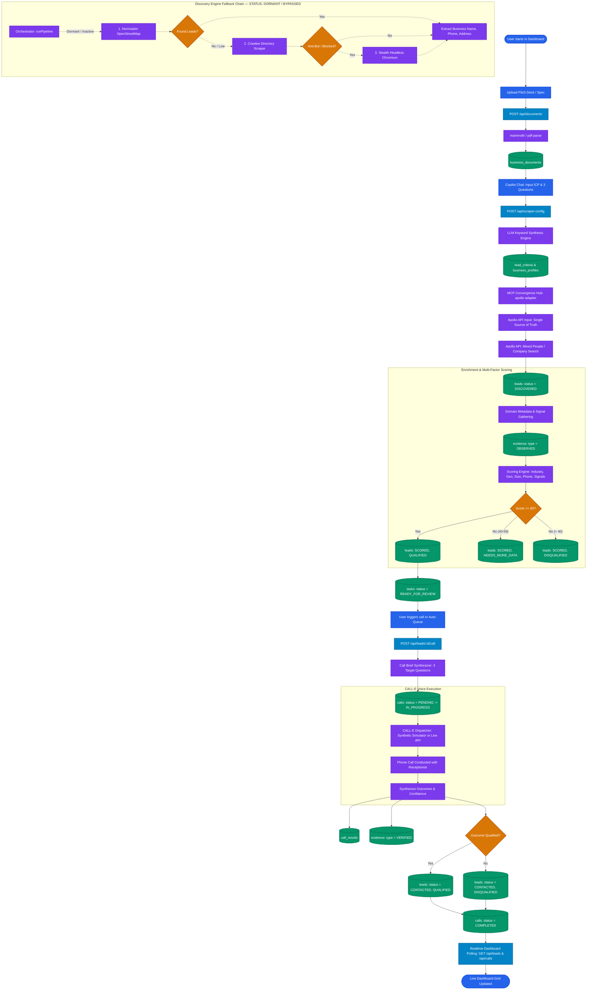
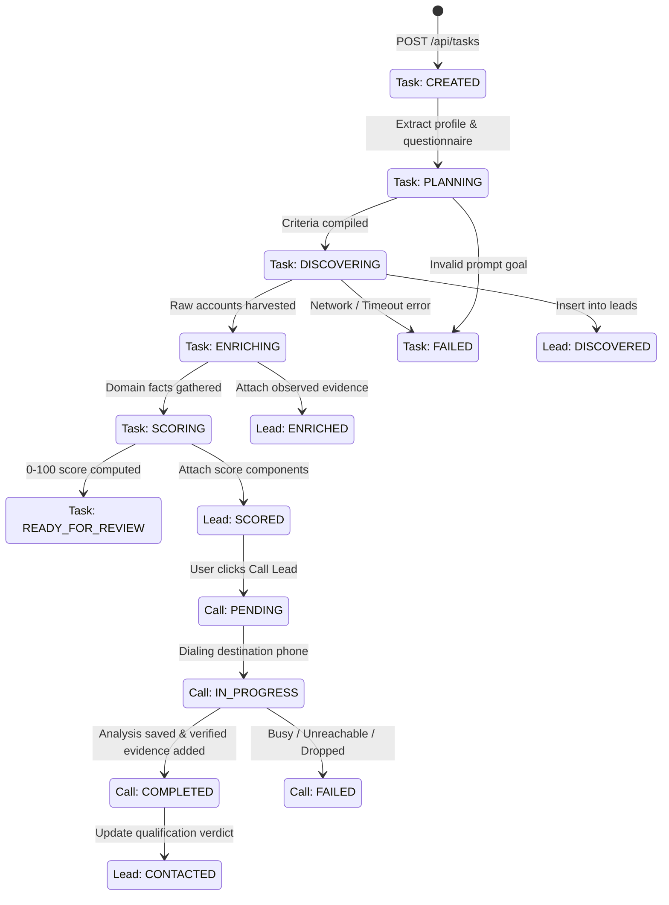
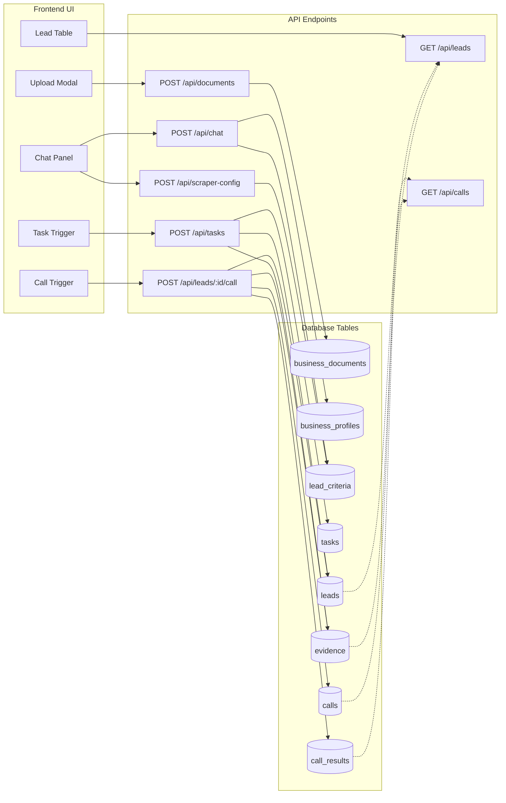
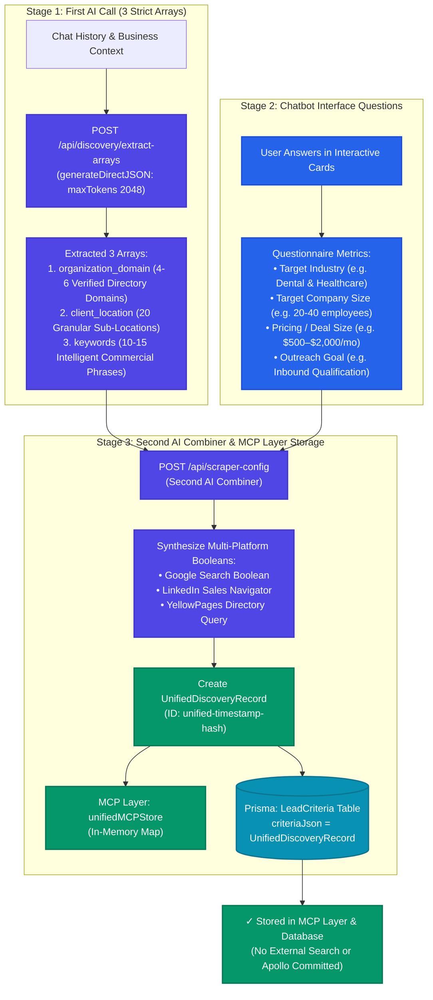
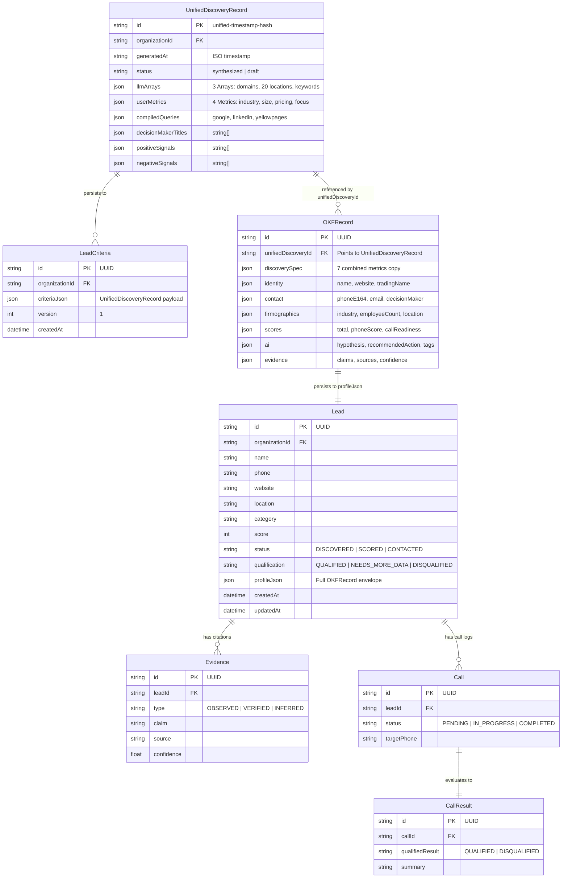
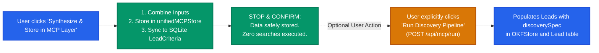
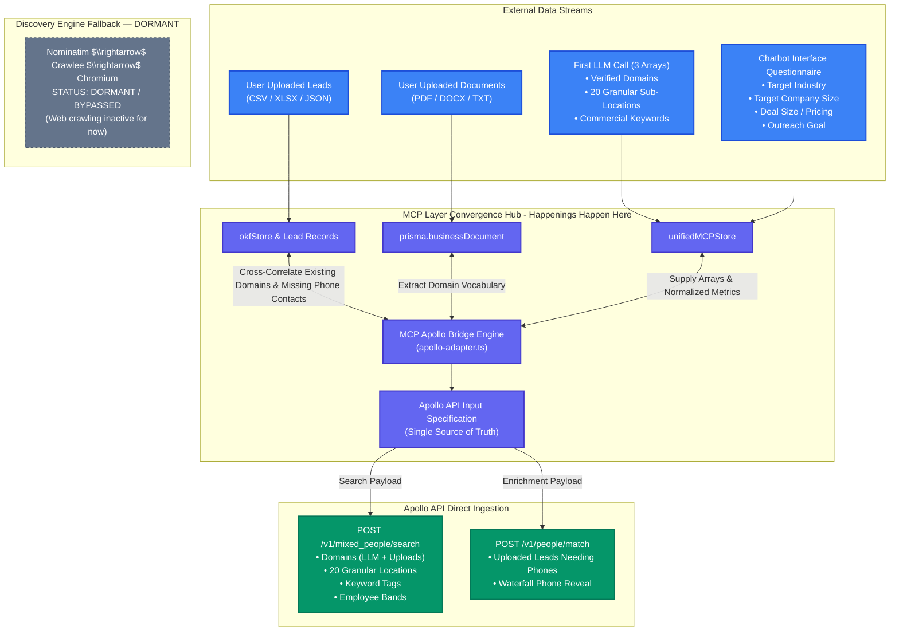

# Visual System Flowcharts — Architecture & Orchestration

This document provides visual flowcharts mapping the system lifecycle, decision branches, database state transitions, and API routing.

---

## 1. Master End-to-End Orchestration Flowchart



---

## 2. Database State Machine Flowchart



---

## 3. Data Flow & Routing Interaction Matrix



---

## 5. MCP Layer Database Architecture & Schema Unification Flowchart

This section illustrates the **MCP Layer** storage architecture, bridging the first LLM 3-array extraction with the user's chatbot questionnaire metrics, storing data into `unifiedMCPStore` and SQLite via Prisma without triggering automated searches.

### A. Two-Stage MCP Schema Unification Flowchart



---

### B. MCP Layer Database Entity-Relationship Diagram (ERD)



---

### C. Storage-Only Policy vs. Optional Discovery



---

## 6. MCP Layer Single Source of Truth for Apollo API Input

### A. Data Interaction Architecture inside the MCP Layer

All data streams converge inside the MCP Layer (`unifiedMCPStore`, `okfStore`, and Prisma database) to form the unified **Single Source of Truth** for Apollo API search and contact enrichment:



### B. Single Source of Truth Payload Structure

```json
{
  "generatedAt": "2026-09-13T02:35:00.000Z",
  "source": "mcp_unified_layer",
  "status": "ready",
  "discoveryEngineStatus": "DORMANT",
  "searchPayload": {
    "q_organization_domains_list": [
      "healthgrades.com",
      "zocdoc.com",
      "ada.org",
      "austindentalcare.com"
    ],
    "person_locations": [
      "Austin, Texas, United States",
      "Round Rock, Texas, United States",
      "Cedar Park, Texas, United States",
      "Pflugerville, Texas, United States",
      "Georgetown, Texas, United States",
      "West Lake Hills, Texas, United States",
      "Lakeway, Texas, United States",
      "Leander, Texas, United States",
      "Bee Cave, Texas, United States",
      "Buda, Texas, United States",
      "Kyle, Texas, United States",
      "San Marcos, Texas, United States",
      "Dripping Springs, Texas, United States",
      "Bastrop, Texas, United States",
      "Travis County, Texas, United States",
      "Williamson County, Texas, United States",
      "Hays County, Texas, United States"
    ],
    "q_organization_keyword_tags": [
      "Dentist",
      "Dental Clinic",
      "Orthodontics",
      "Dental & Healthcare Clinics",
      "CALL-E Phone Qualification"
    ],
    "organization_num_employees_ranges": [
      "11,20",
      "21,50"
    ],
    "person_titles": [
      "Owner",
      "CEO",
      "Founder",
      "Practice Manager",
      "Managing Partner",
      "Clinical Director",
      "Operations Manager"
    ],
    "q_keywords": "Dental & Healthcare Clinics Dentist Dental Clinic",
    "page": 1,
    "per_page": 25
  },
  "enrichmentPayload": {
    "recordsToMatch": [
      {
        "organization_name": "Austin Dental Arts",
        "domain": "austindentalarts.com",
        "source": "user_upload"
      }
    ],
    "reveal_phone_number": true,
    "run_waterfall_phone": true,
    "webhook_url": "http://localhost:3000/api/apollo/webhook"
  },
  "stats": {
    "totalTargetDomains": 4,
    "totalTargetLocations": 17,
    "totalKeywords": 5,
    "uploadedLeadsReferenced": 190,
    "uploadedDocsReferenced": 1
  }
}
```

